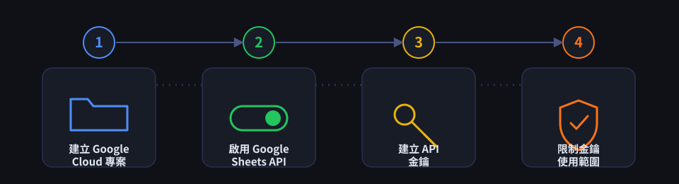
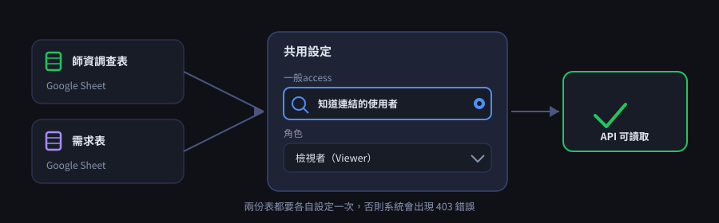
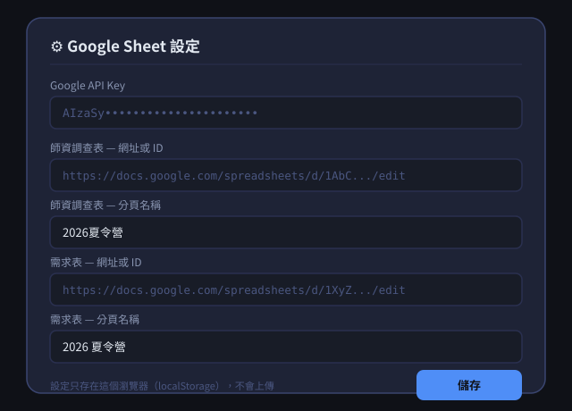

# 夏令營排課系統

純前端的夏令營排課工具。不需要架設後端伺服器，資料即時從 Google Sheet 讀取，排課演算法在瀏覽器裡執行，排課結果可以直接匯出成 Excel。

🌐 **上線網址**：[rein0325.github.io/teacher-schedule](https://rein0325.github.io/teacher-schedule/)
📦 **Repository**：[github.com/rein0325/teacher-schedule](https://github.com/rein0325/teacher-schedule)


## 功能特色

- **免伺服器**：純 HTML/CSS/JS，已部署在 GitHub Pages 上，開啟網址就能用
- **Google Sheet 即時串接**：師資調查表、需求表都直接從 Google Sheet 抓取最新內容，不用手動下載上傳
- **自動排課演算法**：以「預計人數」為權重，逐週做最佳化配對，並優先保護唯一候選人的班級
- **手動調整**：排課結果可點格子換人、查看候選人清單、強制指派、鎖定
- **匯出 Excel**：一鍵匯出含主表、老師課表、未排清單、暫不排課清單、鎖定警告的完整活頁簿
- **繼續調整**：可以用 Google Sheet 目前內容或上次匯出的 Excel 檔還原排課進度繼續編輯
- **四種主題**：暗黑（預設）、清晨米白、薰衣草、夏日陽光

## 系統需求

- 現代瀏覽器（Chrome / Edge / Safari 最新版即可，需支援 Web Worker）
- 一組 **Google API Key**（啟用 Sheets API）
- 兩份 Google Sheet：師資調查表、需求表

---

## 開始使用

不需要安裝或部署任何東西，直接打開上線網址即可：

**🌐 https://rein0325.github.io/teacher-schedule/**

第一次使用前，需要設定 Google Sheets API，請看下一節。

---

## 設定 Google Sheets API

系統要能「即時抓取」Google Sheet 內容，需要一組啟用了 Sheets API 的 **API Key**，並且兩份表都要設成「知道連結的人可檢視」。整體流程如下：



### Step 1：建立 Google Cloud 專案

1. 前往 [Google Cloud Console](https://console.cloud.google.com/)
2. 右上角專案選單 → 「新增專案」
3. 輸入專案名稱（例如「夏令營排課系統」）→ 建立

### Step 2：啟用 Google Sheets API

1. 左側選單「API 和服務」→「程式庫」
2. 搜尋 `Google Sheets API`
3. 點進去 → 按「啟用」

### Step 3：建立 API 金鑰

1. 「API 和服務」→「憑證」
2. 「建立憑證」→「API 金鑰」
3. 複製產生的金鑰字串，等一下要貼到系統的「⚙️ 設定」裡

### Step 4：限制金鑰使用範圍（強烈建議）

因為這組 Key 會出現在前端網頁（任何人打開瀏覽器的開發者工具都看得到），**一定要限制它的用途**，否則被盜用會有被亂扣費或濫用的風險：

1. 在剛建立的金鑰旁點「編輯」
2. 「應用程式限制」選擇 **HTTP 轉介網址（網站）**，填入你的 GitHub Pages 網址，例如：
   `https://rein0325.github.io/*`
3. 「API 限制」選擇 **限制金鑰**，只勾選 **Google Sheets API**
4. 儲存

### Step 5：設定 Google Sheet 共用權限

師資調查表、需求表**都要各自**設成「知道連結的使用者皆可檢視」，API 才讀得到內容：



1. 打開該份 Google Sheet → 右上角「共用」
2. 「一般access」改成「知道連結的使用者」
3. 角色選「檢視者」即可（不需要給編輯權限）
4. 完成

> 如果「繼續調整」要讀取 Google Sheet 上手動填寫的排課結果（子選項 A），角色一樣選「檢視者」就夠了，系統只讀不寫。

### Step 6：在系統內填入設定

回到系統，右上角「⚙️ 設定」，填入以下欄位：



| 欄位 | 說明 |
|---|---|
| Google API Key | Step 3 取得的金鑰 |
| 師資調查表 — 網址或 ID | 可以貼完整網址，或只貼 `/d/` 後面那段 ID |
| 師資調查表 — 分頁名稱 | 該份表裡實際的分頁（工作表）名稱，區分大小寫與空白 |
| 需求表 — 網址或 ID | 同上 |
| 需求表 — 分頁名稱 | 同上 |

按「儲存」後設定會存在**這台電腦、這個瀏覽器**的 localStorage 裡，不會上傳到任何地方；換電腦或清瀏覽器資料需要重新填一次。

---

## Google Sheet 資料格式需求

系統的解析邏輯是照固定的欄位/列格式讀取，兩份表的格式必須符合下列規則：

### 師資調查表

第一列是表頭，資料從第二列開始，每一列代表一位老師的一次填寫回覆（同姓名的多筆回覆會自動合併，欄位採聯集）。需要的表頭（可與其他欄位並存，順序不拘）：

| 表頭 | 說明 |
|---|---|
| `姓名` | 老師姓名（合併回覆的依據） |
| `時間戳記` | 選填，用來判斷「最新一次填寫時間」 |
| `是否有意願教授2026夏令營課程(7/1~8/28任一周)` | 填「是」/「否」，決定是否列入候選 |
| `可擔任講師` | 填「是」/「否」 |
| `可擔任助教` | 填「是」/「否」 |
| `可授課校區` | 用逗號、頓號或斜線分隔多個校區，例如：`大直校,板橋校` |
| `Priority` | 0～5 的整數，數字越大排課優先度越高 |
| `可授課時段[週次]` | 每個週次一欄，例如 `可授課時段[7/1~7/5]`，填「是」/「否」 |
| `可教授課程[課程名]` | 每個課程一欄，例如 `可教授課程[Minecraft]`，填「是」/「否」 |

### 需求表

第一欄（A 欄）用來標記「週次列」與「角色列」：

- **週次列**：A 欄內容需符合 `M/D~M/D` 格式（例如 `7/1~7/5`），下一列固定是「預計人數」列
- **角色列**：緊接在預計人數列之後、下一個週次列之前，A 欄內容需為 `講師`、`助教` 或 `延時`（延時只是額外顯示，不影響排課）
- 每個校區固定佔用一組欄位（預設：安和校 B–E、延壽校 F–H、大直校 I–K、板橋校 L–N），同一欄從上到下就是同一個班級：課程名稱 → 預計人數 → 講師/助教姓名

> 校區欄位分組、預計人數門檻（預設 ≤3 人不排）、助教人數公式（預設 `max(0, ceil(預計人數/8) - 1)`）、優先課程清單、校區優先順序目前是寫死在 `js/dataFetch.js` 的 `DEFAULT_SETTINGS_RAW` 裡，如果你們的表格結構或規則不同，需要直接修改該檔案（目前系統沒有提供介面調整這些設定）。

---

## 使用流程


### 頁面一：匯入資料

| 模式 | 資料來源 |
|---|---|
| 全新排班 | 師資表 + 需求表都直接從 Google Sheet 即時抓取 |
| 繼續調整 — 從 Google Sheet | 兩份表都即時抓取；需求表上如果已經有人手動填了名字，會當作起始已排課狀態 |
| 繼續調整 — 上傳 Excel | 師資表照樣抓 Google Sheet；排課結果從上次匯出、你自己保存的「排課結果.xlsx」還原 |

### 頁面二：老師設定

- **角色鎖定**：同時具備講師＋助教資格的人，可鎖定整個營期只擔任其中一種角色
- **助教保護週數**：新進人員可設定前 N 週只排助教，之後才排講師
- 設定完成後按「執行排班 →」，排課演算法會在背景執行（資料量大時需要幾分鐘）

### 頁面三：排班結果

- 點格子 → 右側面板顯示候選人 → 點名字換人
- 候選人清單下方可展開「強制指派」，指定任何人（含不符資格者）
- 「補排缺額」：保留已排格子，只填補空格
- 「全部重新排班」：清空重跑演算法
- 完成後按右上角「⬇ 匯出 Excel」下載結果

**格子樣式說明**

| 樣式 | 意義 |
|---|---|
| 橘色左邊框 | 小班（≤ 3 人），需手動排課 |
| ⚠ 符號 | 排課未達應配置人數 |
| 黃色高亮 | 目前選取的格子 |
| 紫色高亮 | hover 候選人時，該人已排的其他格子 |

---

## 排班規則

| 預計人數 | 應配置 |
|---|---|
| ≤ 3 人（小班） | 不自動排，需手動指派 |
| 4 ~ 8 人 | 講師 × 1 |
| 9 ~ 17 人（依實際公式計算，邊界±1人以系統計算為準） | 講師 × 1、助教 × 1 |
| ≥ 18 人 | 講師 × 1、助教 × 2 |

候選人資格（必須同時符合）：

1. 填過夏令營意願問卷且填「是」
2. 具備對應角色（講師/助教）
3. 可授課時段包含該週
4. 可授課校區包含該校區
5. 可教授課程包含該課程
6. 同一週尚未被排入其他課

排班優先順序：Priority 數值高者優先 → 可授課時段較少者優先（減少浪費）→ 已排課次數較少者優先（均衡分配）。

---

## 匯出 Excel 格式

| 工作表 | 內容 |
|---|---|
| 主表（沿用原表名或從零建立） | 排班結果，講師/助教格子已填入姓名 |
| 全部清單 | 所有課程（不分有沒有排到） |
| 未排清單 | 仍有缺口的格子，含原因 |
| 暫不排課清單 | 小班（≤ 3 人）清單 |
| 老師課表 | 依老師列出所有排課明細，含講師/助教人次統計 |
| 鎖定警告 | 鎖定老師發生衝突時的警告（沒有警告則不會產生這個分頁） |

> 「全新排班」（資料來自 Google Sheet、沒有原始 xlsx 檔）匯出時，主表會依需求表紀錄的儲存格座標從零重建；「繼續調整 — 上傳 Excel」則會複製你上傳的那份檔案當底稿，保留其他分頁與格式。

---

## 檔案結構

```
.
├── index.html              # 主頁面（三步驟 UI、設定 Modal、使用說明）
├── css/
│   └── style.css           # 四種主題的樣式
├── js/
│   ├── state.js            # 全域狀態、Google Sheet 設定持久化（localStorage）
│   ├── utils.js             # 共用 UI 工具（toast/loading/goStep...）
│   ├── theme.js             # 主題切換
│   ├── scheduleUtils.js      # 排課共用工具函式（字串清理、排序鍵比較...）
│   ├── dataFetch.js          # 解析 Google Sheet / Excel → 師資、需求、結果報表
│   ├── googleSheets.js       # 呼叫 Google Sheets API
│   ├── scheduler.js          # 排課核心演算法（位元遮罩 + 動態規劃）
│   ├── scheduler.worker.js   # 在 Web Worker 執行排課核心，避免卡住 UI
│   ├── candidates.js         # 手動換人時的候選人清單邏輯
│   ├── exportExcel.js        # 匯出 Excel（ExcelJS）
│   ├── page1.js / page2.js / page3.js   # 三個頁面各自的互動邏輯
└── assets/img/               # README 與系統內使用說明共用的示意圖
```

> `js/scheduler.worker.js` 這個檔名一定要跟 `scheduler.js` 裡 `new Worker('js/scheduler.worker.js')` 的路徑完全一致，命名或路徑打錯排班時會直接卡住沒有任何錯誤訊息。

---

## 本機開發／重新部署（進階，一般使用不需要看這節）

這個 repository 已經部署在 GitHub Pages 上（見最上方連結），平常使用直接打開網址就好。下面是給要修改程式碼、或想另外複製一份重新部署時參考的步驟。

### 本機預覽

這是純靜態網站，用任何靜態伺服器開啟即可（不能直接用 `file://` 開啟，瀏覽器會擋 Web Worker 與跨檔案讀取）：

```bash
# 進入專案資料夾後
python3 -m http.server 8000
# 或
npx serve .
```

然後打開 `http://localhost:8000`。

### 部署到 GitHub Pages

1. 在 GitHub 建立一個新的 repository，設定為 Public 或 Private 都可以（Private 也能開 Pages，但仍要注意 API Key 是前端可見的，見下方〈安全性提醒〉）。
2. 把整個專案資料夾內容推上去：

   ```bash
   cd teacher-schedule
   git init
   git add .
   git commit -m "Initial commit: 夏令營排課系統"
   git branch -M main
   git remote add origin https://github.com/rein0325/teacher-schedule.git
   git push -u origin main
   ```

3. 到 GitHub 該 repository 的 **Settings → Pages**：
   - Source 選擇 `Deploy from a branch`
   - Branch 選擇 `main`，資料夾選 `/ (root)`
   - 按 Save
4. 等 1～2 分鐘，網址會出現在同一個頁面，格式通常是：
   `https://<你的帳號>.github.io/<repo名稱>/`
5. 打開這個網址，右上角「⚙️ 設定」填入 Google Sheet 設定即可使用。

> 之後每次修改程式碼，`git add . && git commit -m "..." && git push` 就會自動更新網站，不需要重新設定 Pages。

---

## 疑難排解

**「從 Google Sheet 抓取資料」按下去出現 403 錯誤？**
確認該份 Google Sheet 的共用設定是「知道連結的使用者皆可檢視」，以及 API Key 是否正確、有沒有被限制成只能從別的網域呼叫（見 Step 4）。

**出現「找不到工作表」或 400 錯誤？**
確認「⚙️ 設定」裡填的分頁名稱跟 Google Sheet 裡的分頁名稱完全一樣（含空白、大小寫）。

**排班按下去一直轉圈圈？**
正常現象，課程數量多時演算法可能需要幾分鐘，請耐心等待，不要重複點擊或關閉分頁。

**老師明明可以教但沒出現在候選人？**
確認師資表中該老師的可授課時段、可授課校區、可教授課程、夏令營意願欄位是否都填寫正確，且該週該人尚未被排入其他課。

**匯出的 Excel 打不開？**
可能是同名檔案仍在其他程式開啟中，請先關閉再重新匯出。

---

## 安全性與隱私提醒

- 這是純前端網站，**所有運算（含讀取 Google Sheet、排課演算法）都在使用者的瀏覽器裡執行**，沒有任何資料會送到 Anthropic 或其他第三方伺服器。
- Google API Key 會出現在瀏覽器可見的網路請求中，**務必依 Step 4 限制它的 HTTP 轉介網址與 API 範圍**，把風險降到「就算外流也只能讀取指定網域下、你允許的 Sheets API」。
- 如果不希望排課資料被任意訪客看到，建議：
  - GitHub repository 設為 Private（GitHub Pages 仍可正常運作，但公開的網址本身沒有登入機制，知道網址的人都能打開頁面）
  - 或考慮額外加上一層存取控制（例如 Cloudflare Access、簡易 Basic Auth 反向代理），這超出本專案目前範圍，需要自行評估與設定。
